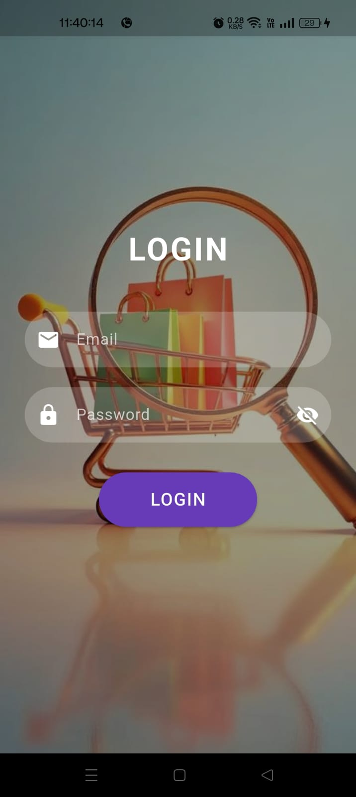
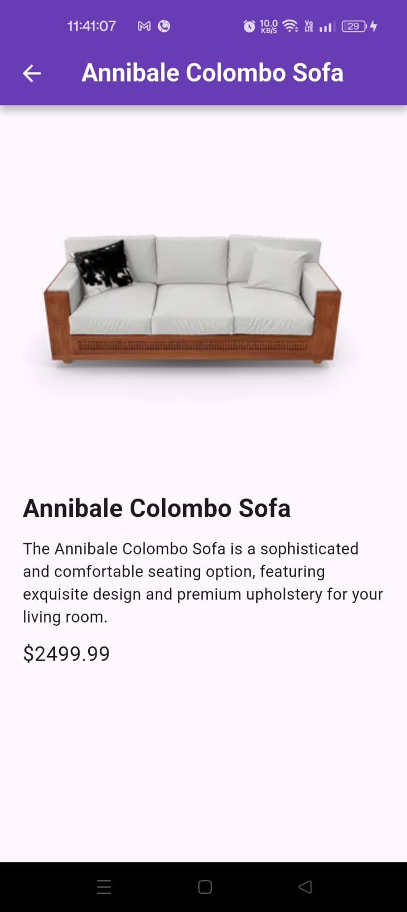

# 📱 Product Listing App
```
This is a Flutter project of Product Listing App. 
The app demonstrates Flutter UI design, API integration, MVC architecture, and state management using setState.
```

---

# 🚀 Features

## 🔐 Login Screen
- Mock login authentication
- Email validation
- Password validation
- Password visibility toggle
- Background image UI
- Circular styled input fields
- Styled login button
- Navigation only when valid email & password entered

## 🛒 Product List Screen
- Fetch products from API
- Scrollable product list
- Product cards UI
- Loading indicator
- Error handling
- Styled AppBar

## 📦 Product Detail Screen
- Product image
- Title
- Description
- Price display
- Styled AppBar
- Clean UI layout

---

# 🏗 Architecture Used

MVC (Model – View – Controller)
```
Model → Data layer (Product model)
View → UI screens
Controller → API & business logic
```

---

### State Management
- setState()

---

## 📂 Project Structure

```
lib/
│
├── models/
│   └── product_model.dart
│
├── controllers/
│   └── product_controller.dart
│
├── views/
│   ├── login_screen.dart
│   ├── product_list_screen.dart
│   └── product_detail_screen.dart
│
└── widgets/
    └── product_card.dart
```

---

# 🛠 Tech Stack

- Flutter
- Dart
- HTTP package
- MVC architecture
- setState state management
- Material UI

---

# 📸 Screenshots

## Login Screen



## Product List Screen


## Product Detail Screen



---

# 🎥 Demo Video

Download here: assets/videos/Demo.mp4

---

# 👨‍💻 Developer
```
Mehandhiga Muthusamy
Flutter Developer Intern Candidate
```

